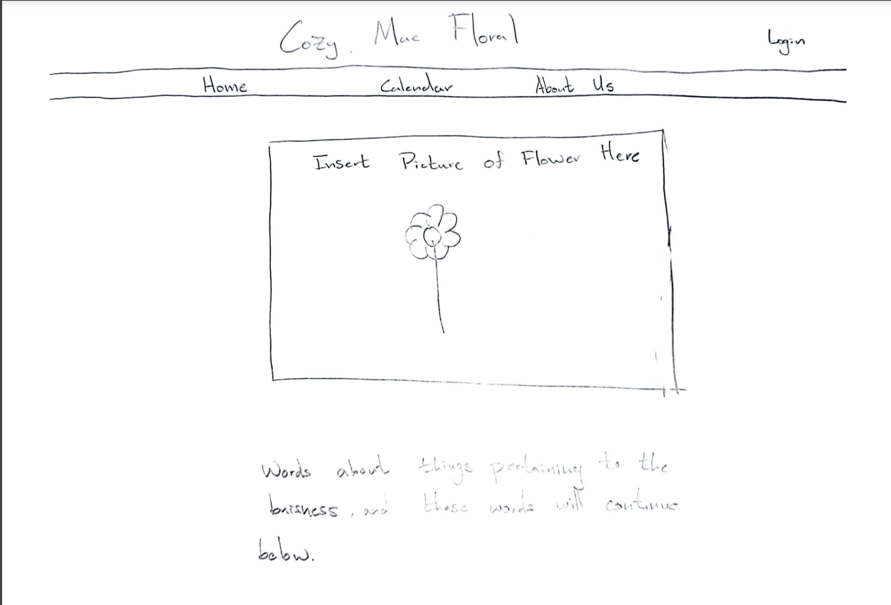
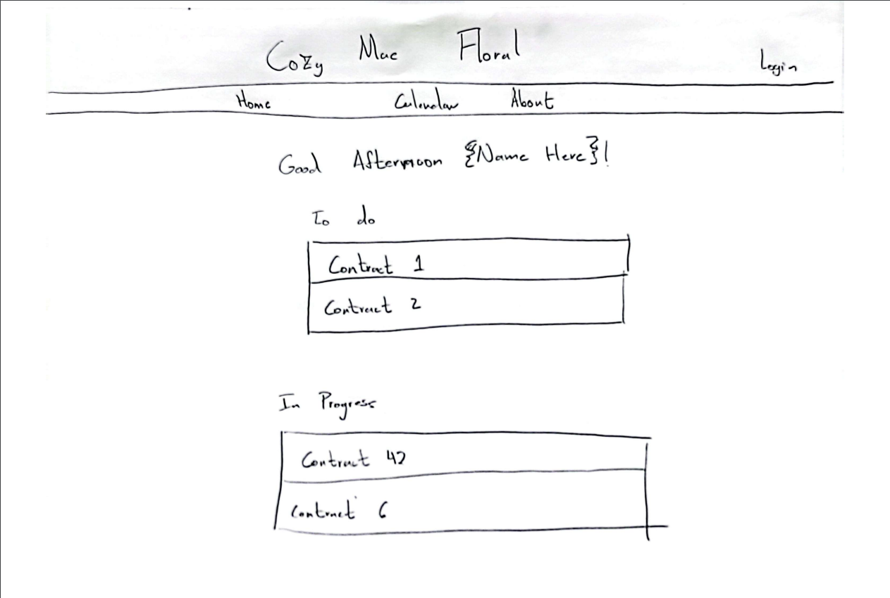
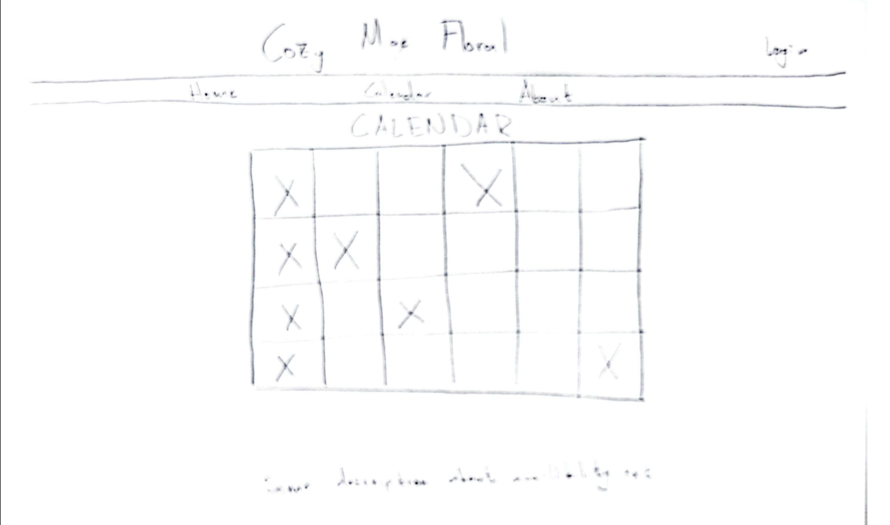

# Startup
Startup application for BYU CS 260

## Specification Deliverable
➡️ The following is part of my specification deliverable.

### Elevator Pitch:

At Cozy Mae Floral, we specialize in personal, handcrafted arrangements that not only suit the occasion but also embody your vision. Unlike many companies that rely on templates and a 'cookie-cutter' process, we focus on creating unique and heartfelt designs that bring warmth and individuality to every event. It’s not just about selling flowers; it’s about delivering a personal touch that makes each moment unforgettable.

### Design:
[//]: # (Include at least 1 photo of the design here)

### Key Features:
[//]: # (Just a description of the features we will add)

- Secure login over HTTPS
- Ability to see scheduled availability, set by the admin, on a calendar.
- Admin ability to send PDF contracts through a third party service.
- User ability to sign contracts through a third party service.
- Ability to see upcoming appointments.
- Admin ability to see progress of contracts.

### Technologies:

The following technologies will be used in the following ways:

- **HTML** - Structure of the web pages. The skeleton the login page, calendar views and contract pages.
- **CSS** - Styling for the entire we application. Both for desktop and mobile use.
- **React** - User interface for secure login, viewing scheduled availability, displaying appointments, and interacting with the contract system.
- **Service** - Backend service with endpoints for:
  - Loging in
  - Managing ppointments
  - Contract viewing
  - Admin functionalities for sending contracts and tracking their progress.
  - Managing schedule availibility.
- **DB/Login** - Store users, appointments, and PDF contracts. Register and login users. Credentials securely stored in database. Can't view appointment or see contracts unless authenticated.
- **WebSocket** - Real-time updates to the calendar when the schedule is modified by the admin, automatically reflecting changes for all users.

## HTML Deliverable
➡️ The following is part of my HTML Deliverable.

- [x] **Deployed Simon HTML** - Deployed Simon to simon.cozymaefloral.com as part of the prerequisite.
- [x] **GitHub Link** - GitHub link is displayed on the home page.
- [x] **Header and Footer** - Header and footers completed for every page except for the login and register pages.
- [x] **Login Page** - A place to log in.
- [x] **Register Page** - A place to register a new user.
- [x] **Placeholder Elements** - Placeholders for contracts and calendar.
- [x] **Home Page (index.html)** - Created an index.html serving as the homepage with navigation and welcome message.
- [x] **Home Page (image)** - Added the only image in the application on the homepage.
- [x] **CSS Styling** - Implemented CSS for overall styling, ensuring responsiveness for desktop and mobile.
- [x] **Service Layer** - Backend service endpoints for login, appointment management, contract viewing, and schedule availability.
- [x] **Database Integration** - Set up a database structure to store users, appointments, and contracts, with secure login functionality.
- [x] **WebSocket Setup** - Included placeholders for WebSocket functionality to provide real-time updates on the calendar.
- [x] **HTML Structure** - Ensured proper use of HTML tags including BODY, NAV, MAIN, HEADER, and FOOTER across all pages.
- [x] **Interactivity** - Added JavaScript placeholders for future interactivity and service integration.

## CSS Deliverable
➡️ The following is part of my CSS Deliverable.

- [x] **Deployed Simon CSS** - Deployed Simon to simon.cozymaefloral.com as part of the prerequisite.
- [x] **Added Company Submark as Icon** - Added a picture of a flower to act as the icon for the tab in the browser.
- [x] **Added Conditional Visibility Of Logo** - If the CozyMae Floral logo fails to load. The alternate text will load. This was added as a condition through the CSS, image-alt class.